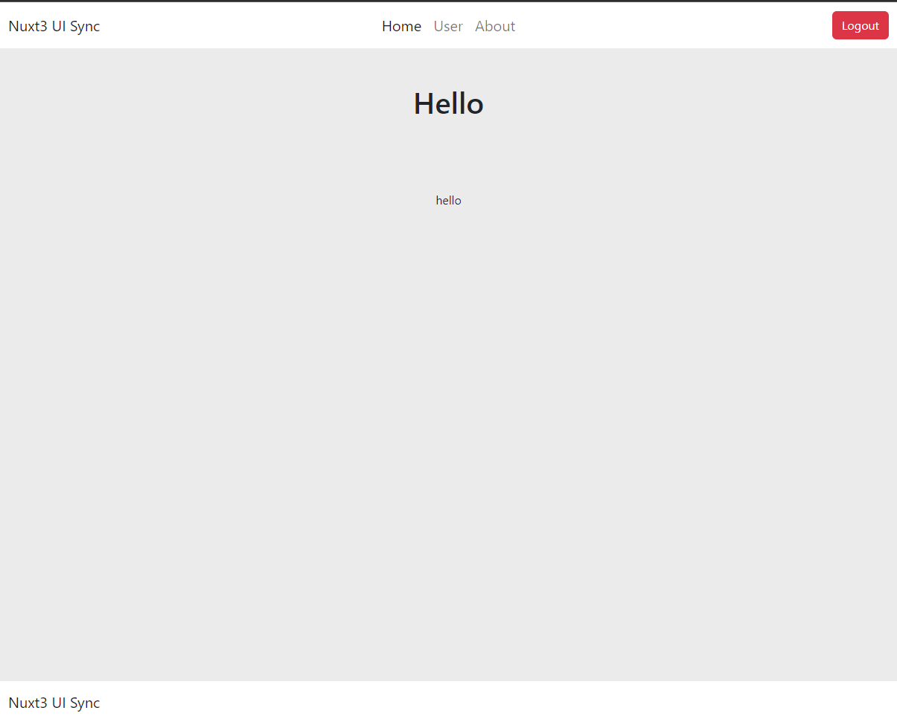

# Nuxt 3 Auth Starter

## Features

- Nuxt ( 3.3 )
- Typescript
- pinia
- eslint + prettier
- sass
- Boostrap

<code>npm run install</code>  
<code>npm run dev</code>

live : <a href="https://nuxt3-auth-starter.vercel.app/">https://nuxt3-auth-starter.vercel.app/</a>
</img>

go to : <code>http://localhost:3000</code>
