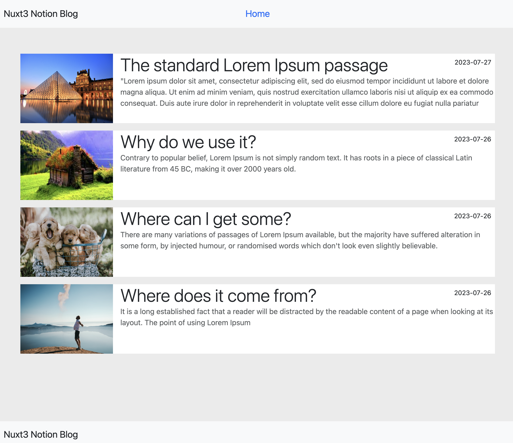

# Notion Blog with Nuxt 3 & Notion API


## Features

- Nuxt ( 3.3 )
- Typescript
- pinia
- eslint + prettier
- sass
- Boostrap

## Installation

```bash
git clone https://github.com/mustafa05deniz/nuxt3-blog-with-notion
cd nuxt3-blog-with-notion

npm install
npm run dev
```

## Config

Change .env file

```bash
notion_db_token       =   YOUR_NOTION_SECRET
notion_version        =   YOUR_NOTION_DATABASE_ID
notion_secret_token   =   NOTION_VERSION
```

## Live

- [https://nuxt3-blog-with-notion.vercel.app/](https://nuxt3-blog-with-notion.vercel.app/)

## Test

- [http://localhost:3000](http://localhost:3000)

## Article

- [Medium Article | Turkish](https://medium.com/@mustafa05deniz/notion-ile-kendi-blog-sayfan%C4%B1z%C4%B1-yapabilirsiniz-dbaa922b10e)

## Preview


